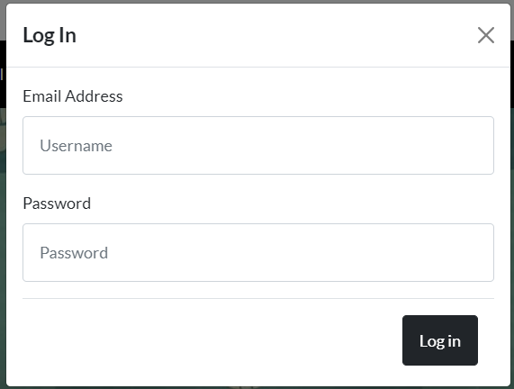
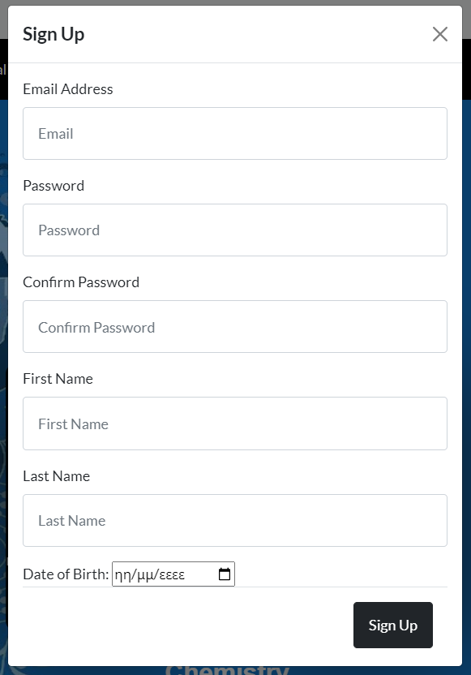
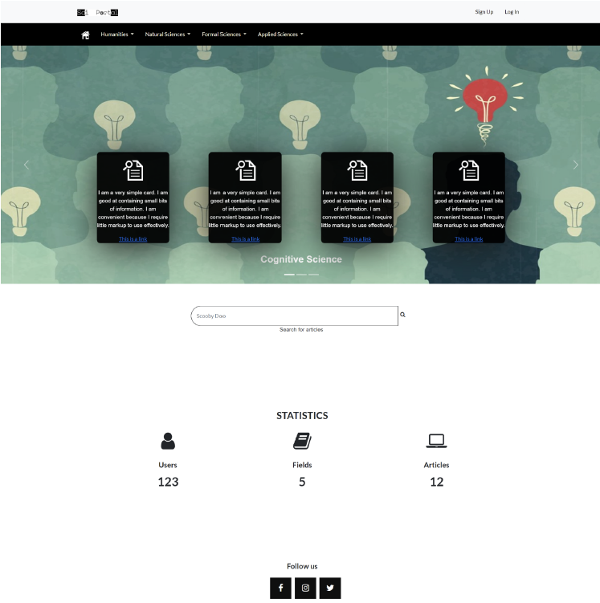
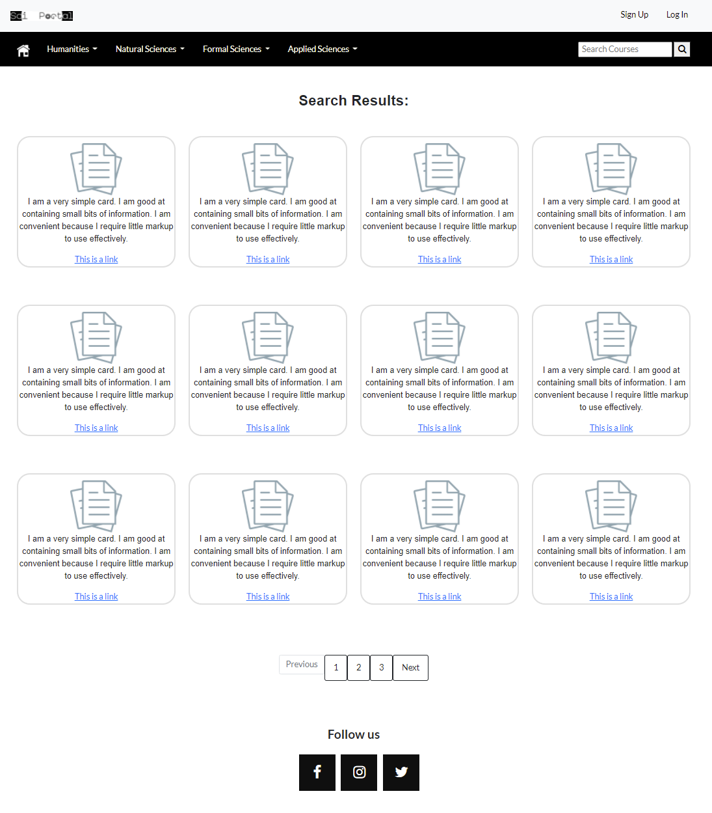
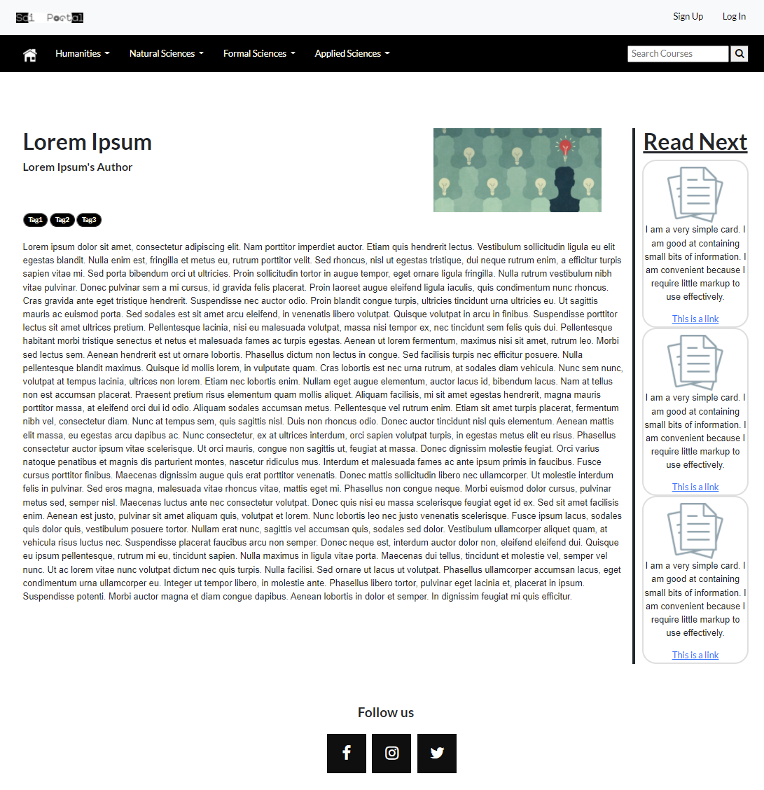
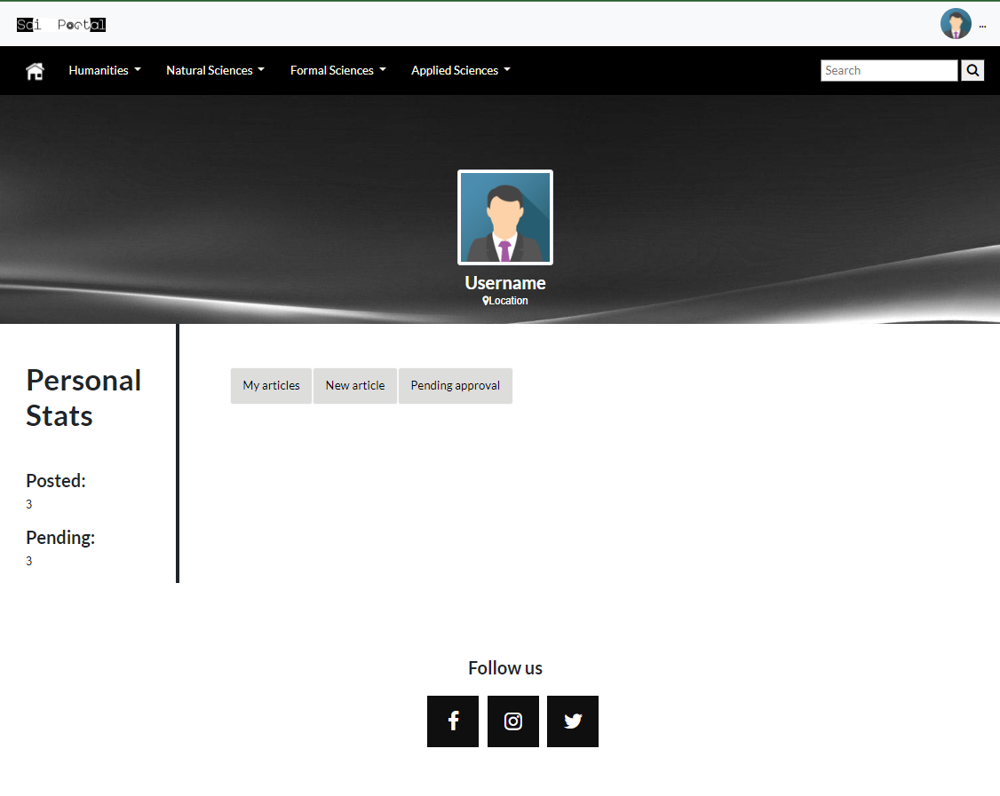
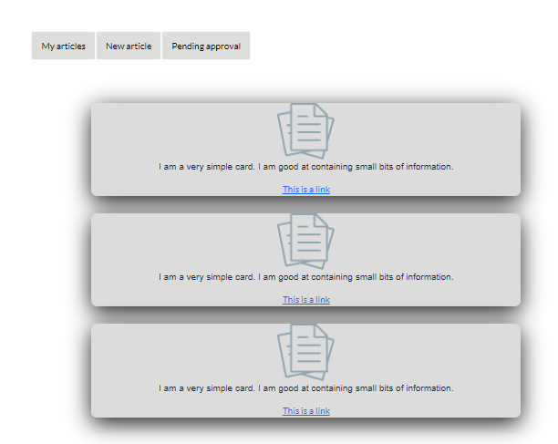
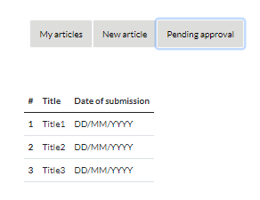
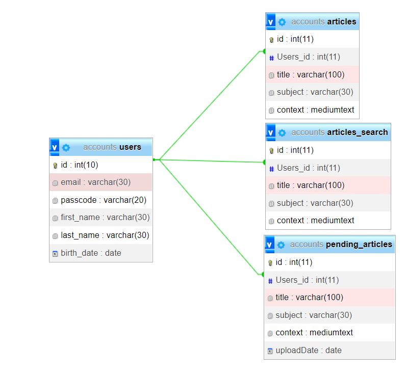

# SciPortal

## 📖 Description
a modern, user-friendly interface that enables scientists and enthusiasts
to publish, discover, and engage with scientific content.

## 📸 Functionality Screenshots

### 🔑 Login/Sign Up

### 🏠 Home

### 📄 Article Search Result

### 📖 Article

### 👤 Account Page and Article Handling

### 🗃️ Database Entities-Relations Diagram

